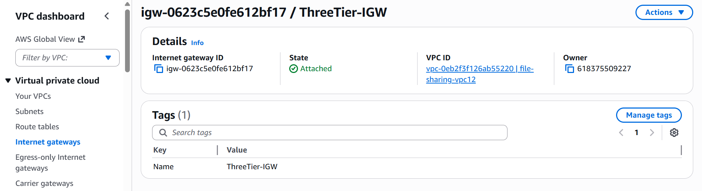
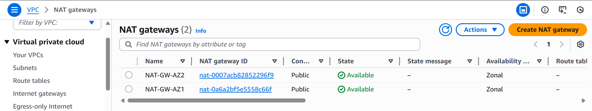
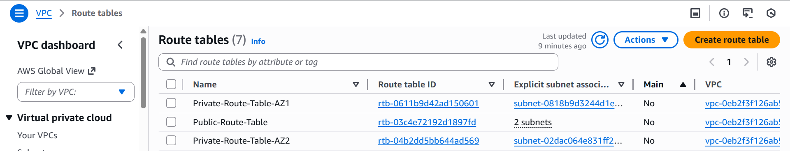
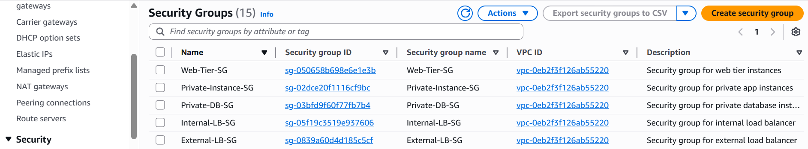
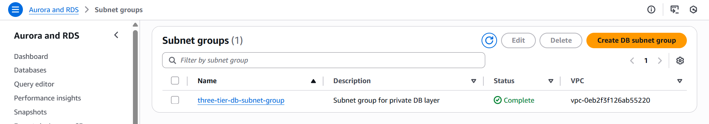
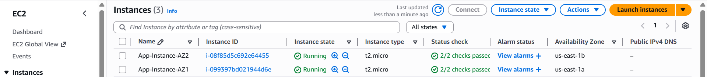
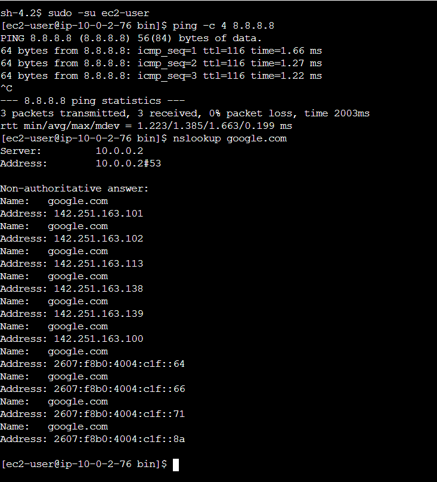
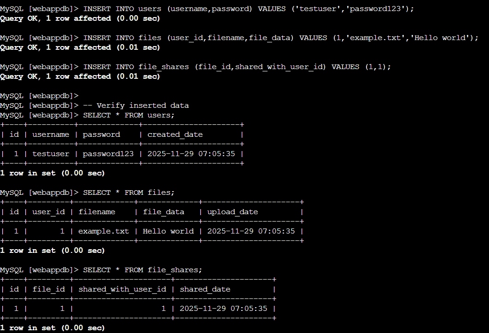
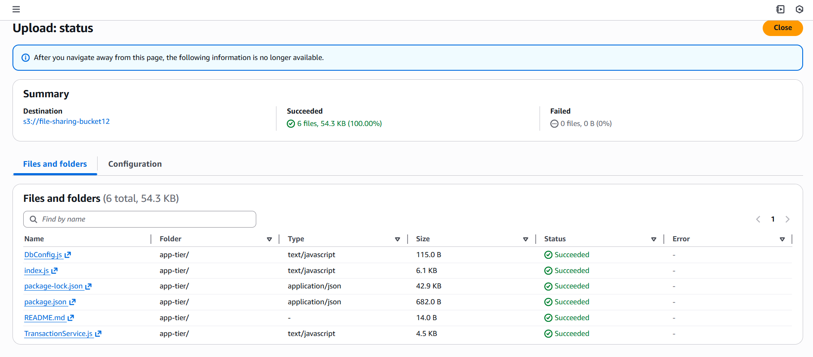
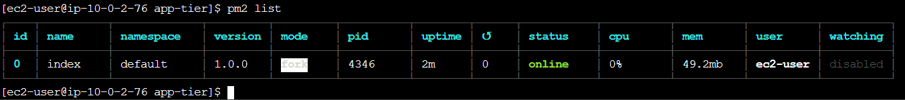

# File Sharing Application - AWS Three Tier Architecture

A secure, scalable file-sharing application built on AWS three-tier architecture with user authentication, file upload/download, and file sharing capabilities.

## 📋 Table of Contents
- [Features](#-features)
- [Architecture Overview](#️-architecture-overview)
- [Setup Guide](#-setup-guide)
  - [Step 1: VPC Configuration](#step-1-vpc-configuration)
  - [Step 2: Subnet Creation](#step-2-subnet-creation)
  - [Step 3: Internet Gateway & Route Tables](#step-3-internet-gateway--route-tables)
  - [Step 4: Security Groups](#step-4-security-groups)
  - [Step 5: Database Setup](#step-5-database-setup)
  - [Step 6: Application Tier Deployment](#step-6-application-tier-deployment)
  - [Step 7: Web Tier Deployment](#step-7-web-tier-deployment)
  - [Step 8: Load Balancer Configuration](#step-8-load-balancer-configuration)
- [API Documentation](#-api-documentation)
- [Database Schema](#️-database-schema)
- [Technology Stack](#️-technology-stack)
- [Project Structure](#-project-structure)
- [Security Considerations](#-security-considerations)
- [Usage Guide](#-usage-guide)
- [Testing](#-testing-the-api)
- [Monitoring & Logs](#-monitoring--logs)
- [Troubleshooting](#-troubleshooting)
- [Known Issues](#️-known-issues--problems)

---

## 🎯 Features

### User Management
- **User Registration** - Simple account creation with username and password
- **User Authentication** - Secure login system
- **Session Management** - Persistent user sessions across the application

### File Operations
- **File Upload** - Upload files of various types (stored as base64)
- **File Download** - Download your uploaded files
- **File Deletion** - Remove files you no longer need
- **My Files Dashboard** - View all your uploaded files with metadata

### File Sharing
- **Share with Users** - Share files with other registered users by username
- **Shared Files View** - See all files that have been shared with you
- **Username Validation** - System validates that recipients exist before sharing
- **Access Control** - Only file owners can share or delete files

---

## 🏗️ Architecture Overview


### Three-Tier Design

**Web Tier (Frontend)**
- React.js single-page application
- Nginx web server serving static content
- Responsive UI with login, dashboard, and file management interfaces
- Public-facing Application Load Balancer distributes traffic

**Application Tier (Backend)**
- Node.js REST API server (Port 4000)
- Express.js framework for routing
- Internal-facing Load Balancer for high availability
- Business logic for authentication, file operations, and sharing

**Database Tier**
- Aurora MySQL multi-AZ database
- Three normalized tables: `users`, `files`, `file_shares`
- Automatic failover and backup capabilities

**Infrastructure**
- Auto-scaling groups at web and app tiers
- Health checks at all layers
- VPC with public and private subnets
- Security groups for network isolation

---

## 🚀 Setup Guide

This guide documents the step-by-step process of setting up the file-sharing application on AWS.

### Prerequisites
1. AWS account with permissions for EC2, RDS, VPC, ELB, Auto Scaling, S3
2. Node.js 14+ and npm installed
3. AWS Academy Lab environment or standard AWS account
4. S3 bucket named `file-sharing-bucket12` for storing application assets
5. Understanding of AWS networking (VPC, subnets, security groups)

---

### Step 1: VPC Configuration

Create a Virtual Private Cloud to isolate your application infrastructure.

**VPC Details:**
- **IPv4 CIDR Block:** `10.0.0.0/16`
- **Region:** us-east-1
- **DNS Hostnames:** Enabled
- **DNS Resolution:** Enabled

**How to Create:**
1. Navigate to VPC Dashboard in AWS Console
2. Click "Create VPC"
3. Select "VPC only"
4. Enter CIDR block: `10.0.0.0/16`
5. Click "Create VPC"

---

### Step 2: Subnet Creation

Create 6 subnets across 2 availability zones for high availability.

**Subnet Configuration:**

| Subnet Name            | Subnet ID                | CIDR          | AZ         | Tier | Type    |
| ---------------------- | ------------------------ | ------------- | ---------- | ---- | ------- |
| Public-Web-Subnet-AZ1  | subnet-08cf1139c7978f3b3 | 10.0.1.0/24   | us-east-1a | Web  | Public  |
| Private-App-Subnet-AZ1 | subnet-0818b9d3244d1e8df | 10.0.2.0/24   | us-east-1a | App  | Private |
| Private-DB-Subnet-AZ1  | subnet-0381b1f52f14b7ac7 | 10.0.3.0/24   | us-east-1a | DB   | Private |
| Public-Web-Subnet-AZ2  | subnet-03a2e3358432a268b | 10.0.101.0/24 | us-east-1b | Web  | Public  |
| Private-App-Subnet-AZ2 | subnet-02dac064e831ff206 | 10.0.102.0/24 | us-east-1b | App  | Private |
| Private-DB-Subnet-AZ2  | subnet-0e99f649f9a486b41 | 10.0.103.0/24 | us-east-1b | DB   | Private |

**How to Create:**
1. Navigate to VPC Dashboard → Subnets
2. Click "Create subnet"
3. Select your VPC
4. For each subnet:
   - Enter subnet name
   - Select availability zone
   - Enter IPv4 CIDR block
   - Click "Add new subnet" for next one
5. Click "Create subnet"

**Subnet Purpose:**
- **Public Web Subnets:** Host web tier EC2 instances with internet access
- **Private App Subnets:** Host application tier EC2 instances (no direct internet access)
- **Private DB Subnets:** Host RDS database instances (no direct internet access)

---

### Step 3: Internet Gateway & NAT Gateway Setup

Enable internet connectivity for your VPC with an Internet Gateway and provide outbound internet access for private subnets using NAT Gateways.

#### Internet Gateway

**Internet Gateway Details:**
- **Name:** ThreeTier-IGW
- **Internet Gateway ID:** igw-xxxxxxxxxxxxxxxxx
- **Attached to VPC:** vpc-0eb2f3f126ab55220

**How to Create:**
1. Navigate to VPC Dashboard → Internet Gateways
2. Click "Create internet gateway"
3. Enter name: `ThreeTier-IGW`
4. Click "Create internet gateway"
5. Select the created IGW and click "Actions" → "Attach to VPC"
6. Select your VPC (10.0.0.0/16)
7. Click "Attach internet gateway"



#### Elastic IPs for NAT Gateways

Allocate Elastic IPs to ensure NAT Gateways have static public IP addresses.

**Elastic IP Configuration:**

| Name        | Allocation ID        | Purpose            |
| ----------- | -------------------- | ------------------ |
| EIP-NAT-AZ1 | eipalloc-xxxxxxxxxxx | NAT Gateway for AZ1 |
| EIP-NAT-AZ2 | eipalloc-xxxxxxxxxxx | NAT Gateway for AZ2 |

**How to Create:**
1. Navigate to VPC Dashboard → Elastic IPs
2. Click "Allocate Elastic IP address"
3. Click "Allocate"
4. Select the allocated EIP and add tag: `Name` = `EIP-NAT-AZ1`
5. Repeat for second EIP with tag: `Name` = `EIP-NAT-AZ2`


#### NAT Gateways

NAT Gateways allow instances in private subnets to access the internet while remaining private.

**NAT Gateway Configuration:**

| Name       | NAT Gateway ID       | Subnet                  | Subnet ID                | Elastic IP  | AZ         |
| ---------- | -------------------- | ----------------------- | ------------------------ | ----------- | ---------- |
| NAT-GW-AZ1 | nat-xxxxxxxxxxxxxxxxx | Public-Web-Subnet-AZ1   | subnet-08cf1139c7978f3b3 | EIP-NAT-AZ1 | us-east-1a |
| NAT-GW-AZ2 | nat-xxxxxxxxxxxxxxxxx | Public-Web-Subnet-AZ2   | subnet-03a2e3358432a268b | EIP-NAT-AZ2 | us-east-1b |

**How to Create:**
1. Navigate to VPC Dashboard → NAT Gateways
2. Click "Create NAT gateway"
3. Enter name: `NAT-GW-AZ1`
4. Select subnet: `Public-Web-Subnet-AZ1`
5. Select Elastic IP: `EIP-NAT-AZ1`
6. Click "Create NAT gateway"
7. Repeat for NAT-GW-AZ2 in Public-Web-Subnet-AZ2 with EIP-NAT-AZ2



**Purpose:**
- **Internet Gateway:** Enables bidirectional internet access for public subnets
- **NAT Gateways:** Enable outbound-only internet access for private subnets
- **Elastic IPs:** Provide static public IP addresses for NAT Gateways
- **Redundancy:** One NAT Gateway per AZ for high availability

---

### Step 4: Route Tables

Configure routing to enable internet access for public subnets and controlled outbound access for private subnets through NAT Gateways.

#### Route Table Configuration

The routing setup ensures that public subnets have internet access while private subnets remain isolated, but can still access the internet via NAT Gateways. This design follows best practices for a three-tier architecture with high availability across two availability zones.

**Public Route Table**

| Property     | Value                                           |
| ------------ | ----------------------------------------------- |
| **Name**     | Public-Route-Table                              |
| **Purpose**  | Provides internet access for web layer instances |
| **Route**    | 0.0.0.0/0 → igw-0623c5e0fe612bf17               |

**Associated Subnets:**
- Public-Web-Subnet-AZ1 (subnet-08cf1139c7978f3b3, us-east-1a)
- Public-Web-Subnet-AZ2 (subnet-03a2e3358432a268b, us-east-1b)

**Justification:** A single public route table is sufficient because all public subnets can share the same route to the IGW. This keeps the network simple and avoids unnecessary duplication.

---

**Private Route Table for AZ1**

| Property     | Value                                                    |
| ------------ | -------------------------------------------------------- |
| **Name**     | Private-Route-Table-AZ1                                  |
| **Purpose**  | Routes external traffic for app layer in AZ1             |
| **Route**    | 0.0.0.0/0 → nat-0a6a2bf5e5558c66f                        |
| **NAT GW**   | Located in Public-Web-Subnet-AZ1 (subnet-08cf1139c7978f3b3) |

**Associated Subnets:**
- Private-App-Subnet-AZ1 (subnet-0818b9d3244d1e8df, us-east-1a)

**Justification:** Each AZ has its own private route table to maintain high availability. This ensures that if one NAT Gateway fails, only the private subnets in that AZ are affected, while the other AZ continues to function.

---

**Private Route Table for AZ2**

| Property     | Value                                                    |
| ------------ | -------------------------------------------------------- |
| **Name**     | Private-Route-Table-AZ2                                  |
| **Purpose**  | Routes external traffic for app layer in AZ2             |
| **Route**    | 0.0.0.0/0 → nat-0007acb82852296f9                        |
| **NAT GW**   | Located in Public-Web-Subnet-AZ2 (subnet-03a2e3358432a268b) |

**Associated Subnets:**
- Private-App-Subnet-AZ2 (subnet-02dac064e831ff206, us-east-1b)

**Justification:** Same as AZ1 — separate NAT Gateway per AZ ensures resilience and redundancy.

---

#### How to Create

**Create Public Route Table:**
1. Navigate to VPC Dashboard → Route Tables
2. Click "Create route table"
3. Enter name: `Public-Route-Table`
4. Select VPC: vpc-0eb2f3f126ab55220
5. Click "Create route table"
6. Select the route table → Routes tab → Edit routes
7. Add route: Destination `0.0.0.0/0`, Target `igw-0623c5e0fe612bf17`
8. Subnet Associations tab → Edit subnet associations
9. Select both Public-Web-Subnet-AZ1 and Public-Web-Subnet-AZ2
10. Click "Save associations"

**Create Private Route Table for AZ1:**
1. Click "Create route table"
2. Enter name: `Private-Route-Table-AZ1`
3. Select VPC: vpc-0eb2f3f126ab55220
4. Click "Create route table"
5. Routes tab → Edit routes
6. Add route: Destination `0.0.0.0/0`, Target `nat-0a6a2bf5e5558c66f`
7. Subnet Associations tab → Edit subnet associations
8. Select Private-App-Subnet-AZ1 (subnet-0818b9d3244d1e8df)
9. Click "Save associations"

**Create Private Route Table for AZ2:**
1. Click "Create route table"
2. Enter name: `Private-Route-Table-AZ2`
3. Select VPC: vpc-0eb2f3f126ab55220
4. Click "Create route table"
5. Routes tab → Edit routes
6. Add route: Destination `0.0.0.0/0`, Target `nat-0007acb82852296f9`
7. Subnet Associations tab → Edit subnet associations
8. Select Private-App-Subnet-AZ2 (subnet-02dac064e831ff206)
9. Click "Save associations"



---

#### Verification and Status

✅ **Internet Gateway:** igw-0623c5e0fe612bf17 is attached to vpc-0eb2f3f126ab55220

✅ **Public Route Table:** Default route (0.0.0.0/0) points to the IGW; associated with both public subnets

✅ **Private Route Tables:** Default routes (0.0.0.0/0) point to their respective NAT Gateways (nat-0a6a2bf5e5558c66f for AZ1, nat-0007acb82852296f9 for AZ2)

✅ **NAT Gateways:** Both are available in correct public subnets with assigned public IPs:
   - AZ1: 98.95.12.253
   - AZ2: 18.235.73.60

✅ **Subnet Associations:** Public subnets use the public route table; private app subnets use their respective private route tables

---

#### Summary / Design Justification

- **One public route table** is sufficient because all public subnets share the same route to the IGW
- **Two private route tables** provide per-AZ NAT Gateway routing, ensuring high availability and fault isolation
- This configuration allows public-facing web servers to reach the internet directly while keeping app layer subnets private, but still allowing them to access the internet for updates or external services via NAT

---

### Step 5: Security Groups

Security groups act as virtual firewalls to control inbound and outbound traffic for AWS resources. This configuration implements defense-in-depth by layering security controls across each tier while maintaining the principle of least privilege.

#### Security Group Overview

| Security Group Name       | Purpose                                    | Protected Resources        |
| ------------------------- | ------------------------------------------ | -------------------------- |
| External-LB-SG            | Public-facing load balancer                | External ALB               |
| Web-Tier-SG               | Web tier EC2 instances                     | Web tier instances         |
| Internal-LB-SG            | Internal load balancer                     | Internal ALB               |
| Private-Instance-SG       | Application tier EC2 instances             | App tier instances         |
| Private-DB-SG             | Database tier                              | Aurora MySQL cluster       |

---

#### External Load Balancer Security Group

**Name:** External-LB-SG

**Purpose:** Protects the public-facing load balancer that serves incoming traffic from the internet.

**Inbound Rules:**

| Type | Protocol | Port | Source        | Description                     |
| ---- | -------- | ---- | ------------- | ------------------------------- |
| HTTP | TCP      | 80   | Your IP/32    | Allow HTTP from your IP         |

**Justification:** Restricting access to your IP ensures only authorized testing traffic can reach the external load balancer while keeping it reachable from the internet.

---

#### Web Tier Security Group

**Name:** Web-Tier-SG

**Purpose:** Protects EC2 instances in the public web tier.

**Inbound Rules:**

| Type | Protocol | Port | Source          | Description                           |
| ---- | -------- | ---- | --------------- | ------------------------------------- |
| HTTP | TCP      | 80   | External-LB-SG  | Allow HTTP from external load balancer |
| HTTP | TCP      | 80   | Your IP/32      | Allow HTTP from your IP for testing   |

**Justification:**
- First rule allows only the external load balancer to forward traffic to web tier instances, enforcing a controlled path
- Second rule allows you to directly test the web tier without exposing it broadly

---

#### Internal Load Balancer Security Group

**Name:** Internal-LB-SG

**Purpose:** Protects the internal load balancer used to forward traffic from the web tier to the private app tier.

**Inbound Rules:**

| Type | Protocol | Port | Source       | Description                    |
| ---- | -------- | ---- | ------------ | ------------------------------ |
| HTTP | TCP      | 80   | Web-Tier-SG  | Allow HTTP from web tier       |

**Justification:** This ensures that only authorized web tier instances can reach the internal load balancer, maintaining the isolation of the app tier from the public internet.

---

#### Private Instance Security Group

**Name:** Private-Instance-SG

**Purpose:** Protects EC2 instances in the private application tier.

**Inbound Rules:**

| Type        | Protocol | Port | Source          | Description                              |
| ----------- | -------- | ---- | --------------- | ---------------------------------------- |
| Custom TCP  | TCP      | 4000 | Internal-LB-SG  | Allow app traffic from internal LB       |
| Custom TCP  | TCP      | 4000 | Your IP/32      | Allow app traffic from your IP for testing |

**Justification:**
- First rule ensures that only the internal load balancer can communicate with app instances on the application port
- Second rule allows manual testing from your IP without compromising overall security

---

#### Private Database Security Group

**Name:** Private-DB-SG

**Purpose:** Protects private database instances.

**Inbound Rules:**

| Type         | Protocol | Port | Source              | Description                        |
| ------------ | -------- | ---- | ------------------- | ---------------------------------- |
| MySQL/Aurora | TCP      | 3306 | Private-Instance-SG | Allow database access from app tier |

**Justification:** Only application tier instances are allowed to communicate with the database, enforcing strict isolation and securing sensitive data from direct public access.

---

#### How to Create Security Groups

**Create External-LB-SG:**
1. Navigate to EC2 Dashboard → Security Groups
2. Click "Create security group"
3. Name: `External-LB-SG`
4. Description: "Security group for external load balancer"
5. VPC: Select vpc-0eb2f3f126ab55220
6. Add Inbound Rule: Type `HTTP`, Source `My IP`
7. Click "Create security group"

**Create Web-Tier-SG:**
1. Click "Create security group"
2. Name: `Web-Tier-SG`
3. Description: "Security group for web tier instances"
4. VPC: Select vpc-0eb2f3f126ab55220
5. Add Inbound Rules:
   - Type `HTTP`, Source `External-LB-SG`
   - Type `HTTP`, Source `My IP`
6. Click "Create security group"

**Create Internal-LB-SG:**
1. Click "Create security group"
2. Name: `Internal-LB-SG`
3. Description: "Security group for internal load balancer"
4. VPC: Select vpc-0eb2f3f126ab55220
5. Add Inbound Rule: Type `HTTP`, Source `Web-Tier-SG`
6. Click "Create security group"

**Create Private-Instance-SG:**
1. Click "Create security group"
2. Name: `Private-Instance-SG`
3. Description: "Security group for app tier instances"
4. VPC: Select vpc-0eb2f3f126ab55220
5. Add Inbound Rules:
   - Type `Custom TCP`, Port `4000`, Source `Internal-LB-SG`
   - Type `Custom TCP`, Port `4000`, Source `My IP`
6. Click "Create security group"

**Create Private-DB-SG:**
1. Click "Create security group"
2. Name: `Private-DB-SG`
3. Description: "Security group for database tier"
4. VPC: Select vpc-0eb2f3f126ab55220
5. Add Inbound Rule: Type `MySQL/Aurora`, Source `Private-Instance-SG`
6. Click "Create security group"



---

#### Traffic Flow Summary

```
Internet → External-LB-SG (port 80) → Web-Tier-SG (port 80) → Internal-LB-SG (port 80) → Private-Instance-SG (port 4000) → Private-DB-SG (port 3306)
```

This layered approach ensures:
- **Defense in depth:** Multiple security layers protect each tier
- **Least privilege:** Each component can only communicate with its immediate neighbors
- **Isolation:** Database tier is completely isolated from public internet
- **Controlled testing:** Your IP has limited access for testing without compromising security

---

### Step 6: Database Subnet Group

A DB Subnet Group defines which subnets Amazon RDS can use for database deployment. This is a prerequisite for creating RDS instances and ensures the database is deployed in the correct private subnets across multiple availability zones.

#### DB Subnet Group Configuration

**DB Subnet Group Details:**
- **Name:** three-tier-db-subnet-group
- **VPC:** vpc-0eb2f3f126ab55220
- **Description:** Subnet group for Aurora MySQL database deployment
- **Status:** Complete

**Included Subnets:**

| Subnet Name           | Subnet ID                | AZ         | Tier | Purpose                    |
| --------------------- | ------------------------ | ---------- | ---- | -------------------------- |
| Private-DB-Subnet-AZ1 | subnet-0381b1f52f14b7ac7 | us-east-1a | DB   | Primary database subnet    |
| Private-DB-Subnet-AZ2 | subnet-0e99f649f9a486b41 | us-east-1b | DB   | Secondary database subnet  |

#### How to Create

1. Navigate to RDS Dashboard in AWS Console
2. In the left sidebar, click "Subnet groups"
3. Click "Create DB subnet group"
4. Enter the following details:
   - **Name:** `three-tier-db-subnet-group`
   - **Description:** `Subnet group for Aurora MySQL database deployment`
   - **VPC:** Select `vpc-0eb2f3f126ab55220`
5. In the "Add subnets" section:
   - **Availability Zones:** Select both `us-east-1a` and `us-east-1b`
   - **Subnets:** Select the private DB subnets:
     - `subnet-0381b1f52f14b7ac7` (Private-DB-Subnet-AZ1)
     - `subnet-0e99f649f9a486b41` (Private-DB-Subnet-AZ2)
6. Click "Create"



#### Design Justification

**Security Isolation:**
- The DB subnet group uses only private subnets, ensuring the database has no direct internet access
- Database instances are completely isolated from public-facing components
- Only authorized application-tier resources can reach the database through security groups

**High Availability:**
- Subnets are distributed across two different Availability Zones (us-east-1a and us-east-1b)
- This configuration enables Multi-AZ deployment for automatic failover
- If one AZ becomes unavailable, the database can continue operating in the other AZ

**Network Architecture:**
- The subnet group provides RDS with flexibility to place database instances optimally
- Ensures compliance with AWS best practices for database deployment
- Supports both primary and standby instances in Multi-AZ configurations

**Operational Benefits:**
- Simplifies RDS instance creation by pre-defining available subnets
- Ensures consistent placement of database resources within the private tier
- Facilitates automated backup and maintenance operations

---

### Step 7: Database Deployment

A MySQL-compatible Amazon Aurora cluster is deployed to support the private database layer of the three-tier architecture. The cluster is configured for high availability and isolated within private subnets.

#### Cluster Details

- **DB Cluster Identifier:** three-tier-app-db-cluster
- **Engine:** aurora-mysql
- **Multi-AZ:** True – ensures high availability across Availability Zones
- **Subnet Group:** three-tier-db-subnet-group – includes private DB subnets in us-east-1a and us-east-1b
- **Master Username:** yourusername
- **Status:** available

#### Endpoints

| Type   | Endpoint                                                                      |
| ------ | ----------------------------------------------------------------------------- |
| Writer | three-tier-app-db-cluster.cluster-cnyoswgyplvb.us-east-1.rds.amazonaws.com   |
| Reader | three-tier-app-db-cluster.cluster-ro-cnyoswgyplvb.us-east-1.rds.amazonaws.com |

- **Writer endpoint:** Used for all read/write database operations.
- **Reader endpoint:** Optional for read-only queries, enabling load distribution.


#### Design Justification

- **Private placement:** The database resides in private subnets to prevent direct internet access.
- **High availability:** Multi-AZ deployment ensures the database remains operational even if one AZ fails.
- **Security:** Access is controlled through the Private-DB Security Group, allowing only authorized app-tier instances to communicate with the database.

---

### Step 8: App Instance Deployment

Two application-tier EC2 instances are deployed in private subnets to host the web/application layer of the three-tier architecture. Instances are distributed across two Availability Zones for high availability and fault tolerance.

#### Instance Configuration

| Variable / Resource     | Value                                                                     | Explanation                                                                                                                                       |
| ----------------------- | ------------------------------------------------------------------------- | ------------------------------------------------------------------------------------------------------------------------------------------------- |
| VPC ID                  | vpc-0eb2f3f126ab55220                                                     | Ensures the instance is launched in the correct network segment that contains our three-tier architecture resources.                             |
| Private App Subnets     | subnet-0818b9d3244d1e8df (AZ1), subnet-02dac064e831ff206 (AZ2)           | Launching in two subnets across different AZs provides redundancy, ensuring the application remains available if one AZ fails.                  |
| Security Group          | sg-02dce20f1116cf9bc (PrivateInstanceSG)                                 | Restricts inbound traffic to only allow authorized sources from the internal network, enhancing security for private instances.                  |
| IAM Instance Profile    | LabInstanceProfile                                                        | Grants EC2 instances the necessary permissions to access AWS resources (e.g., SSM, S3) securely without embedding credentials.                  |
| AMI ID                  | ami-0c02fb55956c7d316 (Amazon Linux 2, Kernel 5.10)                      | Provides a standard, supported OS image for the instances, ensuring compatibility with AWS services and security updates.                        |
| Instance Type           | t2.micro                                                                  | A small instance type suitable for dev/test workloads in AWS Academy labs; cost-effective while sufficient for this application tier.           |
| Auto-assign Public IP   | Disabled                                                                  | Instances remain in private subnets and are not exposed to the internet, enforcing network isolation.                                            |
| Tags                    | Name=App-Instance-AZ1 / App-Instance-AZ2                                 | Helps identify instances easily in the console and for automation purposes.                                                                      |

#### Deployment Details

- **AZ1 instance:** Subnet subnet-0818b9d3244d1e8df, Private IP 10.0.2.76 (running)
- **AZ2 instance:** Subnet subnet-02dac064e831ff206, Private IP 10.0.102.62 (running)



#### Design Justification

- **High Availability:** Two instances in separate AZs ensure the application tier continues to operate if one AZ fails.
- **Private Placement:** Instances remain private, limiting exposure to the internet and enforcing the three-tier security model.
- **IAM Profile Usage:** Attaching LabInstanceProfile provides necessary permissions securely without using hard-coded credentials.
- **Cost-Effective Dev/Test Setup:** t2.micro instances are suitable for lab and testing environments while minimizing AWS costs.
- **Standard AMI:** Using Amazon Linux 2 ensures OS compatibility, reliability, and up-to-date security patches.

#### Why we proceed without a key pair

No key pair is needed for AWS Academy lab instances because we use AWS Systems Manager (SSM) to access the EC2 instances.

The LabInstanceProfile includes the AmazonSSMManagedInstanceCore policy, which allows secure shell access via Session Manager without requiring SSH keys.

**Benefits of skipping a key pair:**
- Simplifies access — no need to manage .pem files or distribute keys.
- Maintains security — reduces risk of leaked SSH keys.
- Fully supported for private instances — since these instances are in private subnets without public IPs, direct SSH via a key would not work anyway.

---

### Step 9: Connect to App Instances & Verify NAT Gateway Connectivity

After deploying the private application instances, you connect to each instance to verify network and NAT gateway setup.

#### Steps

1. **Connect via Session Manager (browser-based):**
   - Open EC2 → Instances in the AWS console.
   - Select a running instance and click Connect → Session Manager → Connect.
   - This establishes a secure session to the instance without requiring a public IP.

2. **Switch to the ec2-user account:**
   ```bash
   sudo -su ec2-user
   ```
   Ensures you are using the standard Amazon Linux 2 user environment.

3. **Verify internet connectivity via NAT gateway:**
   ```bash
   ping -c 4 8.8.8.8
   ```
   Confirms that private instances can access the internet for updates or API calls.
   Even though the instances have no public IP, outbound traffic is routed through the NAT gateway in their respective public subnets.

4. **Optional DNS check:**
   ```bash
   nslookup google.com
   ```
   Ensures DNS resolution works through the NAT gateway.

5. **Repeat for the second instance:**
   - Connect via Session Manager
   - Switch to ec2-user
   - Ping 8.8.8.8 to confirm connectivity




#### Design Justification

- **Private Subnets:** Instances remain private to prevent direct internet exposure, enhancing security.
- **NAT Gateway:** Provides controlled outbound internet access for software updates and external API calls.
- **Session Manager:** Allows secure browser-based access to private instances without public IPs.
- **High Availability:** Instances in two separate availability zones verify NAT and routing in both subnets.

#### Key Points

- Do not use EC2 Instance Connect; private subnets prevent public connectivity.
- Ping success confirms routing tables, NAT gateways, and subnet associations are correctly configured.
- Both AZ1 and AZ2 instances should independently demonstrate internet access.

---

### Step 10: Configure Aurora RDS Database for File Sharing Application

After deploying the Aurora RDS cluster, the database is configured using a private app instance.

#### Steps

1. **Install MySQL client on the EC2 instance**
   ```bash
   sudo yum install mysql -y
   ```
   This enables the instance to connect to the Aurora RDS cluster.

2. **Connect to the Aurora RDS writer endpoint**
   - Endpoint: three-tier-app-db-cluster.cluster-cnyoswgyplvb.us-east-1.rds.amazonaws.com
   - Connect using the MySQL CLI with the configured username and password.

3. **Create the application database**
   ```sql
   CREATE DATABASE webappdb;
   USE webappdb;
   ```
   webappdb will store all tables for the file sharing application.

4. **Create required tables**
   - users – stores application users with username, password, and creation date.
   - files – stores uploaded files with references to the uploading user.
   - file_shares – stores sharing relationships between files and users, enforcing unique sharing rules.
   - Indexes are created on user_id and file_id columns for performance.

5. **Verify tables**
   ```sql
   SHOW TABLES;
   ```
   Confirms presence of: users, files, file_shares.

6. **Insert sample data for testing**
   - Insert a test user, file, and file share entry.
   - Verify with SELECT * FROM ... queries.

#### Sample data:

| Table       | Columns / Sample Values                                                                                    |
| ----------- | ---------------------------------------------------------------------------------------------------------- |
| users       | id: 1, username: testuser, password: password123, created_date: 2025-11-29 07:05:35                       |
| files       | id: 1, user_id: 1, filename: example.txt, file_data: Hello world, upload_date: 2025-11-29 07:05:35        |
| file_shares | id: 1, file_id: 1, shared_with_user_id: 1, shared_date: 2025-11-29 07:05:35                               |



#### Justification

- Writer endpoint is used for creating and modifying data; the reader endpoint is reserved for read-only queries and scaling.
- Running commands from a private app instance ensures secure access through the VPC and NAT gateway.
- Foreign keys and indexes ensure data integrity and query performance.
- Verification of tables and sample data confirms the database is correctly initialized and ready for application use.

---

### Step 11: Configure App Instance

After deploying the EC2 instances for the app tier, the next step is to configure them to run the Node.js backend application and connect to the Aurora RDS database.

#### 1. Upload app-tier to S3

- Open the S3 console and navigate to your bucket: `file-sharing-bucket12`.
- Upload your local app-tier folder to the bucket by selecting Upload → Add folder → app-tier → Upload.
- Verify that all files, including DbConfig.js, are present.



**Justification:**
- Using S3 allows your private app instances to securely download application code without exposing the instances to the public internet.
- Storing code in S3 simplifies deployments and ensures reproducibility.

#### 2. Update Database Credentials

- Open app-tier/DbConfig.js locally.
- Fill in the database configuration:
  - Hostname: three-tier-app-db-cluster.cluster-cnyoswgyplvb.us-east-1.rds.amazonaws.com
  - User: your Aurora RDS username
  - Password: your Aurora RDS password
  - Database: webappdb
- Save the file.

**Justification:**
- The app needs these credentials to connect to the database.
- For simplicity, credentials are stored in the configuration file; in production, AWS Secrets Manager or Parameter Store should be used.

#### 3. Connect to App Instance via SSM

- Open an SSM session to the private app instance (AZ1 or AZ2).
- Ensure your IAM role (LabRole) has permissions for SSM and S3 access.

**Justification:**
- SSM provides secure shell access to private instances without needing public IPs or SSH keys.

#### 4. Install Node.js and PM2

Run the following commands in the SSM session:

```bash
# Install NVM
curl -o- https://raw.githubusercontent.com/nvm-sh/nvm/v0.38.0/install.sh | bash
source ~/.bashrc

# Install Node.js v16 and use it
nvm install 16
nvm use 16

# Install PM2 globally
npm install -g pm2
```

**Explanation & Justification:**
- Node.js v16 is compatible with the app code.
- NVM allows easy switching of Node.js versions in the future.
- PM2 ensures the app runs continuously, even if the instance reboots or the session closes.

#### 5. Download App Code from S3

```bash
cd ~/
aws s3 cp s3://file-sharing-bucket12/app-tier/ app-tier --recursive
cd ~/app-tier
npm install
```

**Explanation & Justification:**
- This retrieves the latest application code from S3.
- npm install ensures all dependencies defined in package.json are installed.

#### 6. Start App with PM2

```bash
pm2 start index.js
pm2 list
pm2 startup
# Copy the command PM2 outputs and execute it
pm2 save
```



**Explanation & Justification:**
- pm2 start index.js launches the backend application.
- pm2 list confirms the process is running.
- pm2 startup + pm2 save ensures the app starts automatically if the instance reboots.

#### 7. Verification

**a) Verify PM2 process**
```bash
pm2 list
```
Status should show online. Use pm2 logs if the app is errored.

**b) Verify database connection**
```bash
mysql -h three-tier-app-db-cluster.cluster-cnyoswgyplvb.us-east-1.rds.amazonaws.com -u yourusername -p
USE webappdb;
SHOW TABLES;
SELECT * FROM users;
SELECT * FROM files;
SELECT * FROM file_shares;
```

Confirms the app can communicate with Aurora RDS. Shows all sample data you previously inserted:

| Table       | Columns / Sample Values                                                                                    |
| ----------- | ---------------------------------------------------------------------------------------------------------- |
| users       | id: 1, username: testuser, password: password123, created_date: 2025-11-29 07:05:35                       |
| files       | id: 1, user_id: 1, filename: example.txt, file_data: Hello world, upload_date: 2025-11-29 07:05:35        |
| file_shares | id: 1, file_id: 1, shared_with_user_id: 1, shared_date: 2025-11-29 07:05:35                               |

**c) Verify local app response**
```bash
curl http://localhost:4000
```
Should return a response from the Node.js app. Confirms the app is running and correctly connected to the database.

#### Justification of Architecture Choices

- **S3:** Central repository for app code, accessible from private subnets.
- **Private app instances:** Keep backend isolated from the internet for security.
- **PM2:** Ensures reliability and automatic restart on failure or reboot.
- **Node.js v16:** Ensures compatibility with app code.
- **SSM connection:** Provides secure management without public IPs or SSH keys.

---
